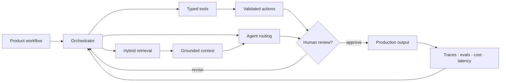

<div align="center">


[](https://git.io/typing-svg)

<p>
	<a href="https://meahmedh.com"></a>
	<a href="https://www.linkedin.com/in/meahmedh/"></a>
	<a href="mailto:contact@meahmedh.com"></a>
	<a href="https://pypi.org/project/createsonline/"></a>
</p>

`Monterrey, Mexico` · `Lenovo Global Technology` · `Open Source Builder`

</div>

## `01 / ENGINEERING PROFILE`

I build **production AI systems, high-performance backends, cloud platforms, and developer tools**. My work spans agentic pipelines, RAG, full-stack products, multilingual media workflows, data systems, and infrastructure automation.

```text
design     → typed boundaries, clean architecture, explicit failure modes
build      → async services, agent workflows, APIs, data and product surfaces
operate    → Docker, CI/CD, observability, security and multi-cloud deployment
optimize   → measured P95/P99 latency, token budgets, caching and parallelism
```

> Current focus: reliable AI agents that combine structured tools, retrieval, human review, and production-grade observability.

## `02 / SYSTEMS I SHIP`

<table>
	<tr>
		<td width="50%" valign="top"><h3>🏗️ <a href="https://pypi.org/project/createsonline/">createsonline</a></h3><p>AI-native Python platform for CMS, ERP, commerce, agents, and data applications.</p><code>Python</code> <code>ASGI</code> <code>PostgreSQL</code> <code>LangChain</code></td>
		<td width="50%" valign="top"><h3>🎙️ <a href="https://voxlate.meahmedh.com">VoxLate</a></h3><p>Open-source AI video dubbing in 28+ languages with speech, translation, and voice pipelines.</p><code>Whisper</code> <code>NLLB-200</code> <code>XTTS-2</code> <code>FFmpeg</code></td>
	</tr>
	<tr>
		<td width="50%" valign="top"><h3>📄 <a href="https://pdf.meahmedh.com">PDFCraft</a></h3><p>Privacy-focused browser PDF toolkit for merging, splitting, compression, and conversion.</p><code>Python</code> <code>PDF</code> <code>Docker</code> <code>Web</code></td>
		<td width="50%" valign="top"><h3>📝 <a href="https://resume.meahmedh.com">Resume Builder</a></h3><p>ATS-focused resume generation, keyword optimization, and professional PDF export.</p><code>AI</code> <code>NLP</code> <code>PDF</code> <code>FastAPI</code></td>
	</tr>
	<tr>
		<td width="50%" valign="top"><h3>🛍️ <a href="https://mejorstyle.com">MejorStyle</a></h3><p>Production ecommerce platform with catalog, cart, checkout, orders, SEO, and CI/CD.</p><code>Commerce</code> <code>Python</code> <code>PostgreSQL</code> <code>Traefik</code></td>
		<td width="50%" valign="top"><h3>🥗 <a href="https://thedietaryhealth.com">The Dietary Health</a></h3><p>Evidence-led nutrition journal and publishing platform for clinicians and researchers.</p><code>CMS</code> <code>Health</code> <code>Publishing</code> <code>Docker</code></td>
	</tr>
</table>

<div align="center"><a href="https://meahmedh.com/portfolio"></a></div>

## `03 / TECHNOLOGY MAP`

<div align="center">

### AI · Agents · Data

[](https://skillicons.dev)


### Product Engineering

[](https://skillicons.dev)

### Platform · Cloud · Delivery

[](https://skillicons.dev)

</div>

## `04 / HOW I BUILD AI SYSTEMS`



- **Async-first:** parallel I/O, streaming, bounded concurrency, explicit timeouts.
- **Typed boundaries:** Pydantic v2, strict TypeScript, validated tool schemas.
- **Observable by default:** structured logs, OpenTelemetry traces, usage and cost tracking.
- **Measured optimization:** improve P95/P99 latency, caching, and batch behavior.
- **Safe autonomy:** retries, idempotency, approval gates, auditable tool execution.

## `05 / OPEN-SOURCE SIGNAL`

<div align="center">


</div>

## `06 / CREDENTIALS`

<details>
<summary><strong>🎓 24+ verified certifications across AI, software, cloud, networking, mobile, and analytics</strong></summary>
<br>

**Cisco Networking Academy**

<a href="https://www.netacad.com/certificates/?issuanceId=1319f671-a223-4500-a569-89ba9d298bca"></a>&nbsp;
<a href="https://www.netacad.com/certificates/?issuanceId=0529c406-54e0-4f95-ba7e-a96430f6440f"></a>&nbsp;
<a href="https://www.netacad.com/certificates/?issuanceId=cb31334b-a665-4be6-a1d1-3bf8755e3d37"></a>

**LangChain AI Academy**

<a href="https://academy.langchain.com/certificates/jiqd5jktmh"></a>&nbsp;
<a href="https://academy.langchain.com/certificates/ul8kmwjqdn"></a>

**Meta · Coursera**

<a href="https://coursera.org/verify/GLEETE8WJHKA"></a>&nbsp;
<a href="https://coursera.org/verify/UAWHS3KUK6KM"></a>&nbsp;
<a href="https://coursera.org/verify/L2RMHHG42CKB"></a>&nbsp;
<a href="https://coursera.org/verify/H9BHLGX5CBMD"></a>&nbsp;
<a href="https://coursera.org/verify/NV8HBESEK9FT"></a>&nbsp;
<a href="https://coursera.org/verify/ED3UQWW3X65S"></a>&nbsp;
<a href="https://coursera.org/verify/LSW82LXBDXHX"></a>

**IBM · Coursera**

<a href="https://coursera.org/verify/TQV3CGL8LTV7"></a>&nbsp;
<a href="https://coursera.org/verify/2HR37YNGJVJ3"></a>&nbsp;
<a href="https://coursera.org/verify/QBEDS7SCFDDX"></a>

**Google Skillshop**&nbsp;
[](https://skillshop.accredible.com/profile/e2d1c392e8ee91e4e4c64ce0ff082c247f8ba68e)


**HubSpot Academy**&nbsp;

[](https://app.hubspot.com/academy/certificates/verify/c44f37e69b484d9aa80c12c98e255a3a)
[](https://app.hubspot.com/academy/certificates/verify/90b0c429717f4c08bad83cd160130ab8)

**EF SET English**

<a href="https://www.efset.org/cert/idz13X"></a>

</details>

## `07 / LANGUAGES & COLLABORATION`


I enjoy collaborating on **production AI agents, developer platforms, RAG, MCP servers, automation systems, data products, and open-source infrastructure**.

<div align="center">

### Let's build something useful.

[](https://meahmedh.com)
[](https://www.linkedin.com/in/meahmedh/)
[](mailto:contact@meahmedh.com)


</div>
